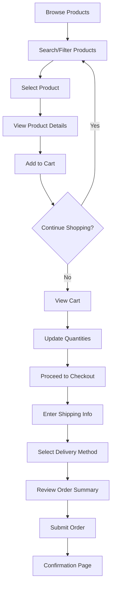
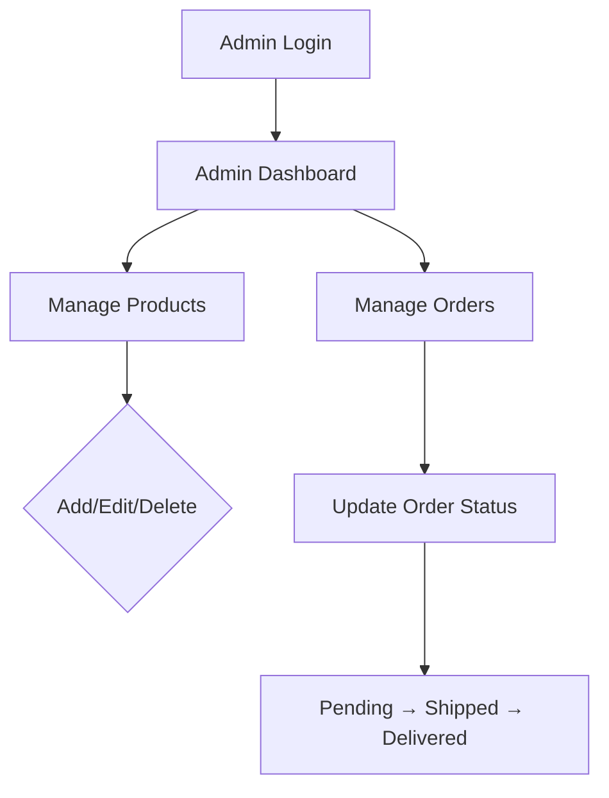

# Link&Style E-Commerce Platform - Product Requirements Document

## 1. Product Overview

Link&Style is a vibrant, full-featured e-commerce platform offering a colorful and inviting shopping experience. The platform enables customers to browse products across Electronics, Clothing, and Books categories, manage shopping carts, complete checkouts, and provides administrators with complete product and order management capabilities.

### Target Users
- **Customers**: Online shoppers seeking Electronics, Clothing, and Books products
- **Administrators**: Store managers handling product inventory and order fulfillment
- **Guest Users**: Shoppers preferring checkout without account registration

---

## 2. Core Features

### 2.1 User Roles

| Role | Registration Method | Core Permissions |
|------|---------------------|------------------|
| Guest | None required | Browse products, search, filter, add to cart, checkout |
| Customer | Email + Password | All guest features + order history, persistent cart |
| Admin | Pre-configured | Product CRUD, order management, status updates |

### 2.2 Feature Modules

#### Module 1: Product Catalog
- **Product Display**: Grid layout showing product image, name, price, description
- **Search Function**: Keyword search filtering products by name
- **Dual Filters**: Category filter (Electronics/Clothing/Books) + Price range slider
- **Pagination**: 10 products per page with page navigation controls
- **Client-side Validation**: Search queries sanitized, price range validated

#### Module 2: Shopping Cart
- **Add to Cart**: One-click add with quantity selector
- **Cart Operations**: Update quantity, remove single item, clear entire cart
- **Price Calculations**: Subtotal, 10% tax, final total (auto-calculated)
- **Persistence**: Cart data stored in localStorage, survives browser sessions
- **Cart Isolation**: Separate carts per user session/guest browser

#### Module 3: Checkout Flow
- **Shipping Form**: Name, email, address, phone fields with validation
- **Email Validation**: RFC-compliant email format checking
- **Non-empty Validation**: All shipping fields required
- **Delivery Selector**: Standard (5-7 days) / Express (1-2 days) options
- **Order Summary**: Preview of items, quantities, totals before submission
- **Order ID Generation**: Unique timestamp-based order ID on submit
- **Confirmation Page**: Display order details with Cash on Delivery badge

#### Module 4: User Account
- **Registration**: Name, email, password with validation
- **Login**: Email/password authentication
- **Order History**: Dashboard showing past orders with status
- **Guest Checkout**: Complete purchase without account creation

#### Module 5: Admin Panel
- **Product CRUD**: Add, Edit, Delete products with form validation
- **Product Fields**: Name, category, price, description, image URL
- **Order List**: Full view of all orders with details
- **Status Updates**: Pending → Shipped → Delivered workflow
- **Access Control**: Admin-only routes protected by role check

---

## 3. Core Processes

### 3.1 Customer Shopping Flow



### 3.2 Admin Management Flow



---

## 4. User Interface Design

### 4.1 Design Style

**Aesthetic Direction**: Bold Maximalism with Playful Energy
- Bright, saturated color palette with gradient accents
- Rounded corners and soft shadows for approachability
- Card-based product displays with hover animations
- Confident typography with display headers

**Color Palette**:
- Primary: `#FF6B6B` (Coral Red)
- Secondary: `#4ECDC4` (Teal)
- Accent: `#FFE66D` (Sunny Yellow)
- Background: `#FAFAFA` (Off-white)
- Text Primary: `#2D3436` (Charcoal)
- Text Secondary: `#636E72` (Gray)
- Success: `#00B894` (Mint)
- Warning: `#FDCB6E` (Amber)
- Error: `#E17055` (Burnt Orange)

**Typography**:
- Display Font: `Poppins` (700, 600 weights) - bold, modern headers
- Body Font: `Nunito` (400, 600 weights) - friendly, readable body text

**Button Styles**:
- Primary: Coral red with white text, rounded-lg, shadow-md hover
- Secondary: Teal outline with teal text
- Danger: Burnt orange for delete actions

**Layout**:
- Top navigation bar with logo, search, cart icon with count
- Sidebar filters on catalog page
- Modal-based cart drawer
- Card grid: 4 columns desktop, 2 columns tablet, 1 column mobile

### 4.2 Page Design Overview

| Page | Module | UI Elements |
|------|--------|-------------|
| Home/Catalog | Hero Banner | Full-width gradient hero, "Shop Now" CTA button |
| Home/Catalog | Product Grid | Cards with image, title, price, "Add to Cart" button |
| Home/Catalog | Filters Sidebar | Category checkboxes, price range slider, Apply button |
| Home/Catalog | Pagination | Page numbers, prev/next arrows, current page highlight |
| Cart | Cart Drawer | Slide-in panel, item list, quantity controls, totals |
| Checkout | Shipping Form | Input fields with floating labels, inline validation |
| Checkout | Delivery Selector | Radio cards with delivery time and price |
| Checkout | Order Summary | Itemized list, subtotal, tax, total |
| Checkout | Confirmation | Success animation, order ID, "Continue Shopping" button |
| Account | Login/Register | Tabbed form, social-style buttons |
| Account | Order History | Table with order date, ID, status badge, total |
| Admin | Product Form | Input fields for name, category dropdown, price, description, image URL |
| Admin | Order Table | Sortable columns, status dropdown, action buttons |

### 4.3 Responsiveness

- **Desktop-first**: 1200px+ optimized layout
- **Tablet**: 768px-1199px, 2-column grid, collapsible filters
- **Mobile**: <768px, single column, bottom sheet cart, hamburger menu

---

## 5. Data Models

### 5.1 Product Schema

```json
{
  "id": "string (UUID)",
  "name": "string",
  "category": "Electronics | Clothing | Books",
  "price": "number (positive)",
  "description": "string",
  "image": "string (URL)",
  "stock": "number (integer >= 0)",
  "createdAt": "timestamp"
}
```

### 5.2 User Schema

```json
{
  "id": "string (UUID)",
  "name": "string",
  "email": "string (unique)",
  "password": "string (hashed)",
  "role": "Customer | Admin",
  "createdAt": "timestamp"
}
```

### 5.3 Cart Schema

```json
{
  "userId": "string (or sessionId for guests)",
  "items": [
    {
      "productId": "string",
      "quantity": "number (positive integer)"
    }
  ],
  "updatedAt": "timestamp"
}
```

### 5.4 Order Schema

```json
{
  "id": "string (unique order ID)",
  "userId": "string (null for guest)",
  "items": [
    {
      "productId": "string",
      "productName": "string",
      "price": "number",
      "quantity": "number"
    }
  ],
  "shippingAddress": {
    "name": "string",
    "email": "string",
    "address": "string",
    "phone": "string"
  },
  "deliveryMethod": "Standard | Express",
  "subtotal": "number",
  "tax": "number (10%)",
  "total": "number",
  "status": "Pending | Shipped | Delivered",
  "createdAt": "timestamp"
}
```

---

## 6. Security Constraints

- **Client-side Validation**: All forms validated before submission
- **XSS Prevention**: HTML entities escaped in all user inputs (search, names, addresses)
- **Password Hashing**: bcrypt-style hashing simulation for stored passwords
- **Role-based Access**: Admin routes check user role before rendering
- **Cart Isolation**: localStorage keys include session/user ID prefix
- **SQL Injection Prevention**: Prepared statement patterns (if SQL used)

---

## 7. Technical Stack

- **Frontend**: React 18 + Vite
- **Styling**: TailwindCSS 3
- **State Management**: React Context + useReducer
- **Data Persistence**: localStorage for cart, users, orders
- **Icons**: Lucide React
- **No External Backend**: All data simulated client-side
