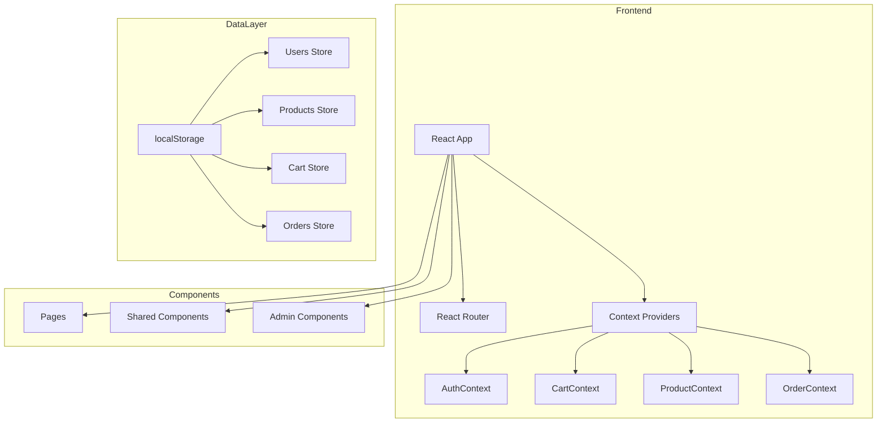

# Link&Style E-Commerce Platform - Technical Architecture Document

## 1. Architecture Overview



---

## 2. Technology Stack

| Layer | Technology |
|-------|------------|
| Framework | React 18 + Vite |
| Routing | React Router DOM v6 |
| Styling | TailwindCSS 3 |
| Icons | Lucide React |
| State | React Context + useReducer |
| Storage | localStorage |
| Build | Vite |

---

## 3. Route Definitions

| Route | Component | Access |
|-------|-----------|--------|
| `/` | HomePage (Product Catalog) | Public |
| `/products` | ProductCatalog | Public |
| `/products/:id` | ProductDetail | Public |
| `/cart` | CartPage | Public |
| `/checkout` | CheckoutPage | Public |
| `/checkout/confirmation/:orderId` | ConfirmationPage | Public |
| `/login` | LoginPage | Public |
| `/register` | RegisterPage | Public |
| `/account` | AccountPage | Customer |
| `/account/orders` | OrderHistory | Customer |
| `/admin` | AdminDashboard | Admin |
| `/admin/products` | AdminProducts | Admin |
| `/admin/products/add` | AddProduct | Admin |
| `/admin/products/edit/:id` | EditProduct | Admin |
| `/admin/orders` | AdminOrders | Admin |

---

## 4. Context Architecture

### 4.1 AuthContext
```typescript
interface AuthContextType {
  user: User | null;
  login: (email: string, password: string) => boolean;
  register: (name: string, email: string, password: string) => boolean;
  logout: () => void;
  isAdmin: boolean;
}
```

### 4.2 CartContext
```typescript
interface CartContextType {
  items: CartItem[];
  addItem: (product: Product, quantity: number) => void;
  updateQuantity: (productId: string, quantity: number) => void;
  removeItem: (productId: string) => void;
  clearCart: () => void;
  subtotal: number;
  tax: number;
  total: number;
  itemCount: number;
}
```

### 4.3 ProductContext
```typescript
interface ProductContextType {
  products: Product[];
  filteredProducts: Product[];
  categories: string[];
  searchQuery: string;
  selectedCategory: string;
  priceRange: [number, number];
  currentPage: number;
  setSearchQuery: (query: string) => void;
  setCategory: (category: string) => void;
  setPriceRange: (range: [number, number]) => void;
  setPage: (page: number) => void;
  addProduct: (product: Product) => void;
  updateProduct: (id: string, product: Product) => void;
  deleteProduct: (id: string) => void;
}
```

### 4.4 OrderContext
```typescript
interface OrderContextType {
  orders: Order[];
  createOrder: (order: OrderInput) => Order;
  updateOrderStatus: (orderId: string, status: OrderStatus) => void;
  getOrdersByUser: (userId: string) => Order[];
}
```

---

## 5. Data Storage Structure

### 5.1 localStorage Keys
| Key | Data Type | Description |
|-----|-----------|-------------|
| `linkstyle_users` | User[] | Registered users |
| `linkstyle_products` | Product[] | Product catalog |
| `linkstyle_orders` | Order[] | All orders |
| `linkstyle_cart_{sessionId}` | CartItem[] | Current cart |
| `linkstyle_current_user` | string | Logged-in user ID |

### 5.2 Initial Product Data
```json
[
  {"id": "uuid-1", "name": "Wireless Headphones", "category": "Electronics", "price": 79.99, "description": "Premium noise-cancelling wireless headphones with 30-hour battery life", "image": "https://picsum.photos/seed/headphones/400/400", "stock": 50},
  {"id": "uuid-2", "name": "Vintage Denim Jacket", "category": "Clothing", "price": 129.99, "description": "Classic vintage-wash denim jacket with brass buttons", "image": "https://picsum.photos/seed/jacket/400/400", "stock": 30},
  {"id": "uuid-3", "name": "JavaScript: The Good Parts", "category": "Books", "price": 24.99, "description": "Essential reading for every JavaScript developer", "image": "https://picsum.photos/seed/book1/400/400", "stock": 100},
  {"id": "uuid-4", "name": "Smart Watch Pro", "category": "Electronics", "price": 299.99, "description": "Advanced fitness tracking and notifications on your wrist", "image": "https://picsum.photos/seed/watch/400/400", "stock": 25},
  {"id": "uuid-5", "name": "Cotton Summer Dress", "category": "Clothing", "price": 59.99, "description": "Lightweight breathable cotton dress perfect for summer", "image": "https://picsum.photos/seed/dress/400/400", "stock": 45},
  {"id": "uuid-6", "name": "Clean Code", "category": "Books", "price": 32.99, "description": "A handbook of agile software craftsmanship", "image": "https://picsum.photos/seed/book2/400/400", "stock": 80},
  {"id": "uuid-7", "name": "Bluetooth Speaker", "category": "Electronics", "price": 49.99, "description": "Portable waterproof speaker with 360-degree sound", "image": "https://picsum.photos/seed/speaker/400/400", "stock": 60},
  {"id": "uuid-8", "name": "Leather Belt", "category": "Clothing", "price": 34.99, "description": "Genuine leather belt with brushed silver buckle", "image": "https://picsum.photos/seed/belt/400/400", "stock": 70},
  {"id": "uuid-9", "name": "Design Patterns", "category": "Books", "price": 44.99, "description": "Elements of reusable object-oriented software", "image": "https://picsum.photos/seed/book3/400/400", "stock": 55},
  {"id": "uuid-10", "name": "Wireless Mouse", "category": "Electronics", "price": 29.99, "description": "Ergonomic wireless mouse with silent clicks", "image": "https://picsum.photos/seed/mouse/400/400", "stock": 90},
  {"id": "uuid-11", "name": "Wool Sweater", "category": "Clothing", "price": 89.99, "description": "Soft merino wool sweater in classic fit", "image": "https://picsum.photos/seed/sweater/400/400", "stock": 40},
  {"id": "uuid-12", "name": "The Pragmatic Programmer", "category": "Books", "price": 39.99, "description": "Your journey to mastery in software development", "image": "https://picsum.photos/seed/book4/400/400", "stock": 65}
]
```

---

## 6. Component Hierarchy

```
App
├── Navbar
│   ├── Logo
│   ├── SearchBar
│   ├── NavLinks
│   └── CartIcon (with badge)
├── Routes
│   ├── PublicRoutes
│   │   ├── HomePage
│   │   │   ├── HeroSection
│   │   │   └── ProductCatalog
│   │   │       ├── FilterSidebar
│   │   │       ├── ProductGrid
│   │   │       │   └── ProductCard
│   │   │       └── Pagination
│   │   ├── ProductDetail
│   │   ├── CartPage
│   │   │   └── CartItem
│   │   ├── CheckoutPage
│   │   │   ├── ShippingForm
│   │   │   ├── DeliverySelector
│   │   │   └── OrderSummary
│   │   ├── ConfirmationPage
│   │   ├── LoginPage
│   │   └── RegisterPage
│   ├── ProtectedRoutes (Customer)
│   │   └── AccountPage
│   │       └── OrderHistory
│   └── AdminRoutes (Admin)
│       ├── AdminDashboard
│       ├── AdminProducts
│       │   ├── ProductForm
│       │   └── ProductTable
│       └── AdminOrders
│           └── OrderTable
└── Footer
```

---

## 7. Validation Rules

### 7.1 Search/Filter Validation
- Search query: Sanitize HTML entities, max 100 characters
- Category: Must match predefined categories
- Price range: Min 0, Max 10000, min <= max

### 7.2 Shipping Form Validation
| Field | Rules |
|-------|-------|
| Name | Required, 2-50 characters |
| Email | Required, valid email format (RFC 5322) |
| Address | Required, 10-200 characters |
| Phone | Required, 10-15 digits |

### 7.3 Checkout Validation
- All shipping fields must be non-empty
- Email must match email regex pattern
- Phone must contain only digits with optional + prefix
- Cart must have at least one item

---

## 8. Security Implementation

### 8.1 XSS Prevention
```javascript
// Escape HTML entities in all user inputs
const escapeHtml = (str) => {
  const div = document.createElement('div');
  div.textContent = str;
  return div.innerHTML;
};
```

### 8.2 Password Hashing
- Simulated bcrypt hashing using SHA-256 via Web Crypto API
- Passwords never stored in plain text

### 8.3 Cart Isolation
- localStorage key includes session ID: `linkstyle_cart_{sessionId}`
- Session ID generated on first visit and stored in sessionStorage

### 8.4 Admin Route Protection
```javascript
const AdminRoute = ({ children }) => {
  const { user, isAdmin } = useAuth();
  if (!user || !isAdmin) return <Navigate to="/login" />;
  return children;
};
```

---

## 10. File Structure

```
src/
├── main.jsx
├── App.jsx
├── index.css
├── contexts/
│   ├── AuthContext.jsx
│   ├── CartContext.jsx
│   ├── ProductContext.jsx
│   └── OrderContext.jsx
├── components/
│   ├── Navbar.jsx
│   ├── Footer.jsx
│   ├── ProductCard.jsx
│   ├── CartItem.jsx
│   ├── FilterSidebar.jsx
│   ├── Pagination.jsx
│   ├── InputField.jsx
│   ├── Button.jsx
│   └── ProtectedRoute.jsx
├── pages/
│   ├── HomePage.jsx
│   ├── ProductDetail.jsx
│   ├── CartPage.jsx
│   ├── CheckoutPage.jsx
│   ├── ConfirmationPage.jsx
│   ├── LoginPage.jsx
│   ├── RegisterPage.jsx
│   ├── AccountPage.jsx
│   ├── OrderHistory.jsx
│   └── admin/
│       ├── AdminDashboard.jsx
│       ├── AdminProducts.jsx
│       ├── AddProduct.jsx
│       ├── EditProduct.jsx
│       └── AdminOrders.jsx
└── utils/
    ├── validation.js
    ├── helpers.js
    └── constants.js
```
